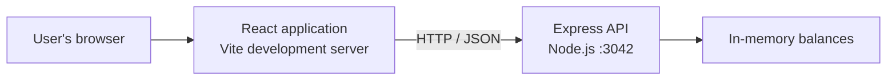

# Application Architecture

## Purpose and scope

`ecdsa-node` is a small educational client/server application that demonstrates deriving Ethereum-style addresses and authorizing balance transfers with ECDSA signatures. It is a centralized simulation: balances live in one Node.js process, and no transaction is submitted to an Ethereum network.

This document describes the implementation in the repository, including its demonstration-only constraints. It is not a production deployment or security specification.

## System context



The browser application is served by Vite during development (normally at `http://localhost:5173`). It calls the API at the fixed base URL `http://localhost:3042`. The Express server enables CORS and JSON request parsing. The API and UI have separate package manifests and are started independently.

## Repository components

| Component | Responsibility |
| --- | --- |
| `client/src/main.jsx` | Mounts the React application. |
| `client/src/App.jsx` | Owns the selected wallet address, private key, and displayed balance; composes the wallet and transfer views. |
| `client/src/Wallet.jsx` | Accepts a private key, derives its Ethereum-style address locally, and requests that address's balance. |
| `client/src/Transfer.jsx` | Collects recipient and amount, hashes the transfer message, signs it locally, submits the transfer, and updates the displayed sender balance. |
| `client/src/server.js` | Creates the Axios client with the API base URL. |
| `server/index.js` | Defines the API, sample accounts, in-memory ledger, address derivation, signature recovery, and transfer validation/application. |

The browser and server both use `ethereum-cryptography` for secp256k1, Keccak-256, and byte/hex conversion. The client additionally uses React, Vite, and Axios; the server uses Express and CORS.

## Runtime flows

### Load a wallet balance

1. The user enters a private key in `Wallet`.
2. The client strips an optional `0x` prefix and checks that the remaining key has 64 hexadecimal characters.
3. The client derives a secp256k1 public key, hashes the uncompressed public key bytes excluding the format prefix with Keccak-256, and uses the final 20 bytes as the address.
4. The client requests `GET /balance/:address`.
5. The server reads the address from its in-memory balance map and responds with `{ "balance": number }`; unknown addresses receive a zero balance.

### Submit a transfer

1. `Transfer` requires a selected address and private key, parses the entered amount as an integer, and creates the message string `sender:recipient:amount`.
2. The client Keccak-256 hashes the UTF-8 message and signs the hash using secp256k1. The private key remains in browser state and is not included in this client-generated request.
3. The client sends `POST /send` with a JSON body containing `sender`, `recipient`, `amount`, and `signature`.
4. The server checks that the amount is positive and that sender and recipient are present. It recreates and hashes the message, attempts public-key recovery for recovery values 0 through 3, derives each recovered address, and compares it with the claimed sender address (case-insensitively).
5. If authorization succeeds and the sender has sufficient funds, the server debits the sender and credits the recipient, then responds with `{ "balance": senderBalance }`.
6. The client replaces the displayed sender balance with the returned balance.

The server also accepts a `privateKey` in place of a signature as a compatibility path. That path derives an address from the submitted key and compares it with the claimed sender. The current UI does not use this path; a production design should remove it rather than treat it as secure compatibility.

## API surface

| Method and path | Request | Success response | Purpose |
| --- | --- | --- | --- |
| `GET /balance/:address` | Address path parameter | `{ "balance": number }` | Read a balance; unknown addresses return zero. |
| `POST /send` | `{ "sender": string, "recipient": string, "amount": number, "signature": string }` | `{ "balance": number }` | Authorize and apply a transfer. The server also accepts `privateKey` instead of `signature`. |

Invalid transfer amounts, missing addresses, failed authorization, and insufficient funds return HTTP 400 with a `{ "message": string }` body.

## State and trust boundaries

- **Browser state:** the current private key, derived address, form values, and displayed balance are held in React component state. The private key is used to sign locally by the current UI flow.
- **Server state:** balances are a JavaScript object initialized from sample accounts when `server/index.js` starts. New sender/recipient entries are initialized to zero during a transfer.
- **Persistence:** none. Balances reset when the server process restarts; there is no database, wallet service, or blockchain node.
- **Authorization:** signature recovery proves control of the private key for the exact message the server reconstructs, subject to the limitations below. The server, not the browser, mutates the balances.
- **Network:** local development uses plain HTTP and a fixed API origin. CORS is enabled without an origin restriction in the current server.

## Important limitations

This code is a learning application and is not suitable for holding or transferring real assets:

- Sample account private keys are embedded in the server source, and the legacy `privateKey` request branch remains enabled. Treat these accounts and keys as public demo material; never reuse them.
- The signed message has no nonce, expiry, chain identifier, or domain separation. A captured valid signature may be replayed while the same transfer remains valid, and signing semantics are not safely bound to a deployment or network.
- The balance map is in-memory and has no durable storage, transaction isolation, or multi-instance coordination.
- Address/message formatting and recipient addresses are not fully validated or normalized before the ledger is updated. Address lookups in the map are case-sensitive even though signature-to-sender comparison is case-insensitive.
- The client stores the private key in ordinary application state and uses an unencrypted HTTP endpoint configured in source. The private key is not sent in the current signed request, but this is not a secure wallet boundary.
- The server accepts a raw private key as an alternate authorization mechanism, contrary to the stronger signature-only flow described in the tutorial.

Production use would require a reviewed signing/message format, replay protection, strict validation and canonicalization, secure key management in a trusted wallet, authenticated and protected transport, durable atomic ledger semantics, and appropriate operational controls.

## Running locally

Start the API in one terminal:

```text
cd server
npm install
node index.js
```

Start the client in another terminal:

```text
cd client
npm install
npm run dev
```

The Vite configuration uses the React plugin; the client build can be checked with `npm run build` from `client`.
